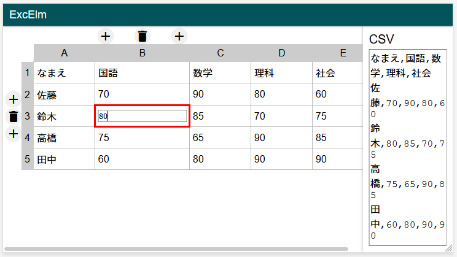

この記事は [Elm Advent Calendar 2019](https://qiita.com/advent-calendar/2019/elm) - 18日目 の記事です。

# 自己紹介

はじめまして、ほない ( [@_honai](https://twitter.com/_honai) ) です。Webフロントが好きな大学生で、今年の8月くらいからElmを触り始めました。
今回は Advent Calender のネタとして、 **Elm でシンプルな Excel** (といっても表計算の機能はなく、表を編集できるアプリです) を作ってみたので、それについて紹介します。

# できたもの



公開のデモを設置しましたが、まだまだバグや操作の不自由が多いのでご注意ください。
デモ： [ExcElm - https://excelm.honai.me/](https://excelm.honai.me/)

ソースコードも公開しています。初心者で良い書き方がわからない部分も多かったので、アドバイスをいただけるとうれしいです。
[honai/exelm - GitHub](https://github.com/honai/exelm)

# 機能

- セルの内容を編集できる
- 行・列の追加・削除ができる
- CSVと双方向で同期する

# 解説

書いたコードについて簡単に解説します。
なお、出てくるコードは元のソースコードから改変している場所があります。

## モデル

### 表

表のモデルは次のように、文字列 or 数値の二次元の Array としました。

```elm
type Cell
    = FloatCell Float
    | StringCell String

type alias Table = Array (Array Cell)
```

これを ports を用いて localStorage に保存することで、永続化しています。
JavaScript 上では表は次のようなデータ形式にして `JSON.Stringfy` で localStorage に保存しています。

```javascript
[
  [{ type: "string", value: "テキストの列" }, { type: "string", value: "数値の列" }],
  [{ type: "string", value: "ABC" }, { type: "float", value: 12 }]
]
```

現時点では数値を `Float` 型で保持する意味はないのですが、簡単な計算などの機能を追加するつもりなのでこのようなカスタム型のセルとしました。

### 入力状態

また、ユーザーの入力の状態も当然モデルに定義されています。

- 選択しているセル (CSVエディター側の場合もある)
- そのセルを編集しているかどうか
- 編集中のテキスト

セルに入力したらモデルの表に即反映させるのではなく、いったん入力中の文字列を保持することで、 `Esc` キーを押して編集のキャンセルができます。

### CSV

右側のテキストボックスで CSV を直接入力したり貼り付けたりできるようになっていますが、CSV の値はモデルとしては保持していません。CSV の文字列は、表のモデルから一意に定まるので、表のモデルと相互に変換できる関数を定義しています。Single Source of Truth の原則です。

## マウスでの操作

### セルの選択

セルをシングルクリックすると選択し、ダブルクリックすると編集することができます。

```elm
td 
    [ onClick <| Slect (row, col)
    , onDoubleClick <| StartEdit (row, col) "セルの値"
    ] [text "セルの値"]
```

### 行・列の追加・削除

選択しているセルの行番号・列番号のところに追加や削除ができるボタンを表示しています。

## キーボードでの操作

今回の実装で一番苦労した部分です。
まず、 `subscriptions` でキーボード押し下げのイベントに登録します。

```elm
keyDecoderDown : JD.Decoder Msg
keyDecoderDown =
    JD.map toDirection (JD.field "key" JD.string)


toDirection : String -> Msg
toDirection string =
    case String.length string of
        1 ->
            StartEdit Nothing string

        _ ->
            case string of
                "ArrowLeft" ->
                    Move Left

                -- (略)

                "Escape" ->
                    CancelEdit

                "Enter" ->
                    StartEdit Nothing ""

                _ ->
                    None


subscriptions : Model -> Sub Msg
subscriptions { input } =
    if input.isEditing then
        Sub.none

    else
        Browser.Events.onKeyDown keyDecoderDown
```

具体的なふるまいは Googleスプレッドシートのものを参考にしました。先述した `Esc` キーでの入力取り消しや、方向キーでの選択セルの移動、Enterキーでの編集開始などができるようになっています。

## UI 設計 / 実装

行・列の追加・削除ができるフローティングボタンは `position: absolute;` で頑張っています。また、行番号・列番号のスクロール時の固定には `table` タグ内の要素に対する `position: sticky;` を使っています。

```css
th.col-header-cell {
  position: sticky;
  top: 0;
}
th.row-header-cell {
  position: sticky;
  left: 0;
}
```

ただし、 `table` 内での `position: sticky;` はまだまだブラウザによる動作の違いもあるようです。

参考: [CSSのみで行・列ヘッダ固定テーブルを実装（Firefox / Chrome / Safari） - Qiita](https://qiita.com/s0tter/items/14fb4ec2600828a21a22)

## 使ったパッケージ

Elm では JS でいう npm のように、ほかの開発者の方が公開しているパッケージを使用することができます。
今回のアプリでは2つのパッケージを使用しています。

- [elm-community/array-extra](https://package.elm-lang.org/packages/elm-community/array-extra/)
- [jonoabroad/commatosed](https://package.elm-lang.org/packages/jonoabroad/commatosed)

**array-extra** は、組み込みのもの以外にも配列 ( `Array` ) を操作する便利なメソッドが使えるようになるパッケージです。表の行/列の操作や、HTMLへの出力時の `List` 型への変換などに使いました。

**commatosed** は RFC での定義に基づいた CSV をパースする関数を提供しており、 CSV と表のモデルの変換に使いました。

# 感想

### モジュールの分け方

結構関数の数が多くなったのでモジュールに分けてグローバルの名前空間を整理したかったのですが、 [elm-spa-example](https://github.com/rtfeldman/elm-spa-example) などを参考にしてもあまりピンとこずモジュール分割ができませんでした。

### キーボード操作

今回の実装で一番難しかったのがキーボード操作です。

- 表の幅が長いときに矢印キーで選択セルを移動するとスクロールもしてしまう
- Tab キーや コピー & ペーストなどのキー操作への対応

などがまだ実装できていない課題です。`subscriptions` や `JSON.Decode` の理解も必要になってくるので、勉強になったと感じています。

参考: [[Elm] Decoder a からいろいろ理解ってしまおう - Qiita](https://qiita.com/ymtszw/items/1cabbdbda4273b4c1978)

### UI のデザイン / CSS コーディング

Excel/スプレッドシートライクな UI を一から作るのはかなり大変だということが分かりました。 **「スプレッドシートとして使える最低限のスタイリングはしよう」** と思っていたのですが、その最低限に達するだけでもかなり苦労しました。行・列番号の固定やフローティングボタン、各列の幅や折り返しなど、CSS でサクッと実装するには考えることが多すぎると感じました。

### まとめ

Elm で シンプルな Excel アプリを実装してみることで、 Elm やキーボード操作、 CSS の新機能などについて学ぶことができました。まだまだ開発途中のアプリなので、いろんな機能を追加してみなさんにも使ってもらえるように頑張ろうと思っています。
最後までお読みいただきありがとうございました。
