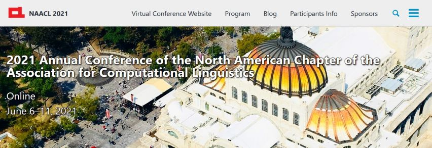
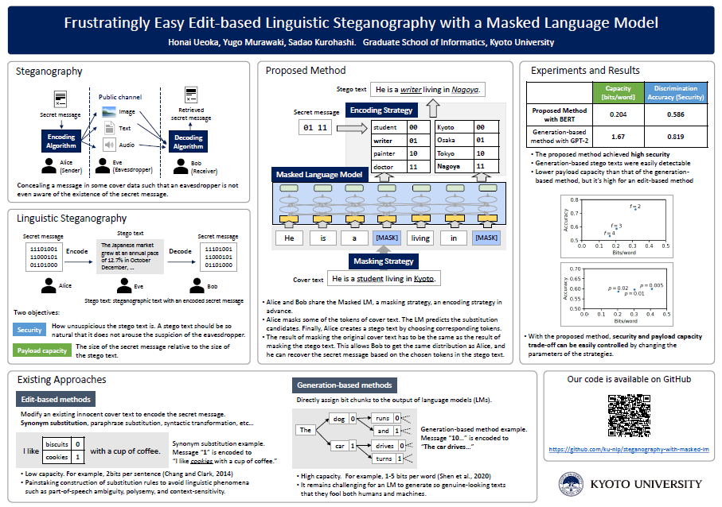
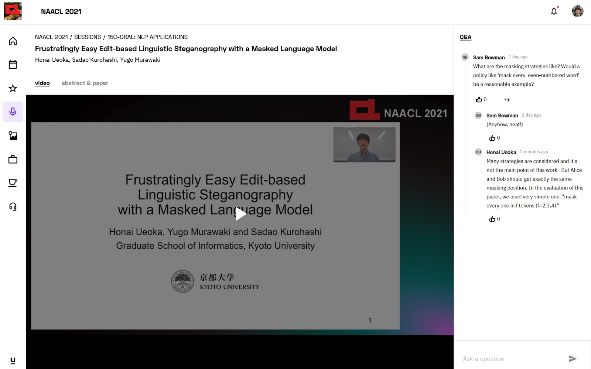
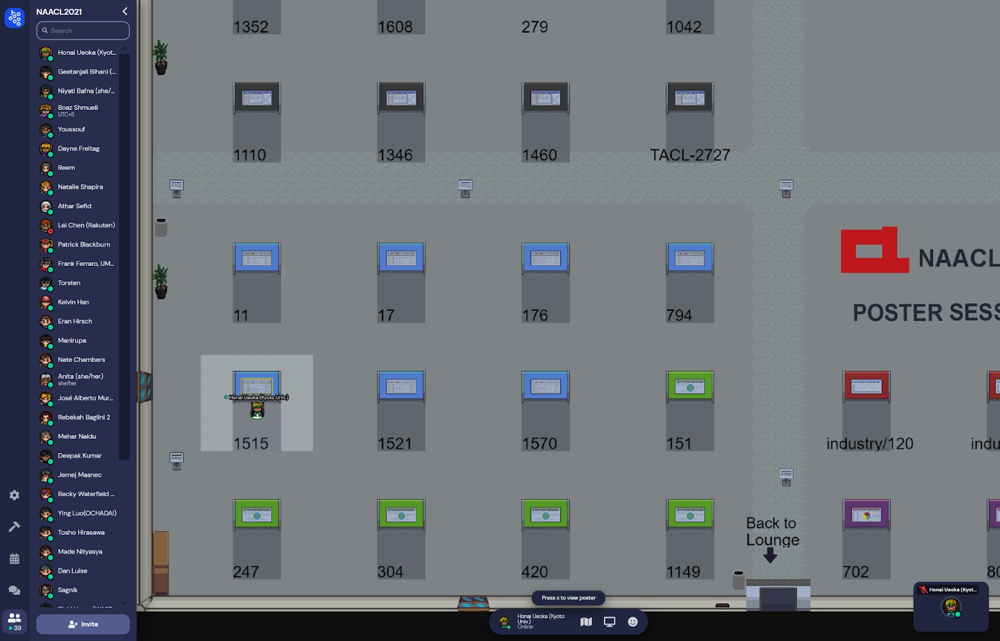

6月上旬に人生初の学会に参加してきました。国際学会で、メキシコで開催されるはずでした。当然ですが完全オンライン開催となり、海外に行くチャンスは訪れませんでした。貴重な経験となったので、振り返りや感想を記しておきます。

## NAACL 2021

参加したのは、ACLやEMNLPと並ぶ [自然言語処理のトップカンファレンス](https://qiita.com/mhangyo/items/4eb5add038d6d4e76c79) の1つ、NAACL 2021です。正式には "2021 Annual Conference of the North American Chapter of the Association for Computational Linguistics - NAACL-HLT 2021" です。

## 投稿した論文

投稿した論文はこちらです。Short Paperです。

> Honai Ueoka, Yugo Murawaki and Sadao Kurohashi. 
> [Frustratingly Easy Edit-based Linguistic Steganography with a Masked Language Model.](https://aclanthology.org/2021.naacl-main.433/) 
> In Proceedings of the 2021 Conference of the North American Chapter of the Association for Computational Linguistics: Human Language Technologies (NAACL-HLT 2021), pp. 5486-5492, online, June 2021. (short paper). 

タイトルを直訳すると「マスク言語モデルによる イライラするほど簡単な言語ステガノグラフィ」です。
この記事では論文の中身については詳しくは触れませんが、分野としては変わり種で、ステガノグラフィという、データの中に見つからないように他のデータを埋め込むような技術についての研究です。

## 時系列でふりかえり

### 2020/11/24 **Final paper submission due** (投稿締切)
ちょうど勤労感謝の日に伴う三連休明けの火曜日の夜9時が締め切りでした。

9～10月に時間があったにも関わらず、あまり進捗がなく、全体的に締め切り前にかなりの負荷がかかってしまいました。クラウドソーシングによる評価に手間取ったり、初めての英語での論文執筆でなかなか書き進められなかったりと、提出前の1週間は大変でした。特に英語の添削は指導教員の先生に大変お世話になり、Technical Writing力不足を痛感しました。

### 2021/01/21-26 **Author Response Period** (査読者への回答期間)
査読者（3人）からのコメントと評価スコアが届き、それに対する回答を執筆し提出しました。
評価が低い査読者からは、提案手法についてというよりも、倫理的に問題があるのではないかという指摘をされていました。情報隠蔽技術なので確かに悪用できますが、暗号などの研究にもすべて当てはまると考え、反論しました。

### 2021/03/11 **Notification of acceptance** (受理の通知)
査読者の平均スコアがちょうどボーダーの目安の少し下くらいだったので正直無理かなと思っていましたが、受理の通知が届きました。通知によると、Charの判断で査読者が1人追加されていました（おそらく倫理面で意見が割れていたため）。

手法や結果の内容で評価されないのなら仕方ないですが、正直、このテーマで倫理面での批判で拒否されるのは心外だったため、Charの判断に感謝しています。

### 2021/04/12 **Camera ready papers due** (最終版の締切り)
受理通知の1か月後に、Camera Readyと呼ばれる最終版の締め切りがありました。

NAACL 2021のShort Paperは、査読時点では（ReferenceやAppendixを除き）4ページの制限があり、査読を受けて内容を改善することを想定して、Camera Readyでは制限が増え5ページになります。

筆者も、査読で指摘された点や、ページの節約のために省いていたやや細かい注釈などを追加しました。

### 2021/05/12 **ポスターと録画発表の締め切り**
おそらく学会の運営側もオンライン化でバタバタしていたのだと予想されますが、5月に入ってから「全員がポスター発表とオーラルでの発表をする」ことになるとの通知がきて、急いでポスター作成とオーラルの録画発表の収録をしました。（普通の対面での学会なら、どちらかで済むはずなのですが。）

ポスターは、現地発表であれば、A0サイズ等に縦で印刷しますが、今回はPDFでの提出で、形式は自由でした。自由がゆえに、向きやフォントサイズやどれくらい詰め込むかなど迷う要素がたくさんありました。筆者は結局、モニタで見やすい横向きで、A3サイズに対して10ptを最小フォントサイズとするくらいのサイズ感でつくりました。

 
<small>ポスター</small>

また、これもオンライン学会ならではですが、オーラル発表のかわりとして、スライドを使っての発表を録画しました。運営から推奨されていたScreencast-o-maticというアプリを使って、Webカメラの映像と音声と画面を収録しました。一発ノーカット撮りしないといけないわけではなく、言い間違えたら言い直して後からトリミングできるので収録は気楽でした。

[オーラル発表のビデオ](https://underline.io/lecture/19735-frustratingly-easy-edit-based-linguistic-steganography-with-a-masked-language-model)
（会員登録しないと再生できないかもしれません。）

### 2021/06/06-11 **学会期間**
いよいよ学会期間です。
Underlineというサービスがメインで、ZoomやGather.townなどを組み合わせたオンライン学会となっていました。

 
<small>オーラル発表の録画の閲覧画面。横にQ&Aのチャットもありました</small>

オーラルの録画とは別に、Zoomでのライブセッションでの短い発表時間がありました。タイムゾーンを考慮したグループ分けがされていたようで、東アジアの大学の人がほとんどのグループで、日本時間で10:30ごろからの発表でした。北アメリカの学会なので時差で深夜に入れられることを覚悟していたので、これはありがたかったかもしれません。

ライブセッションの後はGather.townでポスター発表の時間が設けられていました。
Gather.townはRPGのような画面でアバターを操作し、近くにいる人とビデオ通話ができる、一風変わったバーチャルコミュニケーションツールです。

 
<small>Gather.townの画面。左下に私のポスターの場所があります。人があまりいないタイミングでスクショしてしまった。</small>

Gather.townのおかげで対面でのポスター発表に近い感覚はありましたが、やはり近づいて通話で話しかけるのは心理的にハードルがありました。

私のポスターのところには発表時間中2人ほど海外の研究者の方が訪れ、質問してくださいました。早すぎて聞き取れず答えられなかった質問もありましたが、良い経験になりました。

## まとめ

自身にとって初めての学会がオンラインになるとは以前は想像もしていませんでした。

通常の対面での学会を経験していないので経験に基づく比較はできませんが、特にポスター発表などはオンラインよりも対面のほうが気軽に交流しやすそうだと感じました。さらに、これは参加者の意識やスタンスにもよるといますが、学会期間中にも予定を入れることができてしまうので、チュートリアルやワークショップ、ポスター発表（聴く側）に出席する優先度が低くなってしまうなどの弊害もありそうです。
そして何より、海外に行ける機会がなくなってしまったのはとても残念に思います。

ただ、全ての投稿論文の録画発表が見られることや、印刷・持ち運びが大変な紙のポスターがないこと、旅費がいらないことなどはメリットといえるでしょう。

筆者現在は昨年度とは別の専攻に進学し、自然言語処理の分野を離れてしまいましたが、とても良い経験になりました。修士の研究もがんばります。
